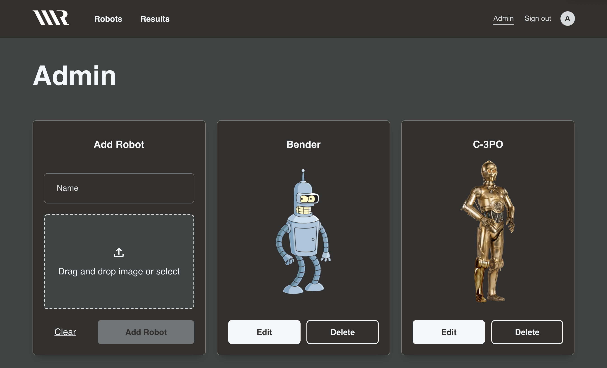

<h1 align="center">🤖 | Robot Art</h1>

<div align="center">

Fancy robots? Yeah we got those. Vote for your favorite and administer the content.

[](https://app.netlify.com/sites/robot-art/deploys)
[](https://github.com/areknow/info-wolf/actions/workflows/build.yml)
[](https://github.com/areknow/info-wolf/actions/workflows/lint.yml)
[](https://github.com/areknow/info-wolf/actions/workflows/test.yml)

<div style="width: 600px">



</div>

</div>

## Project details

Robot Art is a fullstack NX monorepo application using React, Express, and Firebase for authentication and storage. Users are able to create a new account or sign in with their Google account. Once authenticated, users can vote on the fanciest robots, and see those results in real time. 

A special administrator account has the ability to create, edit, and delete robots from a protected adminstration panel. Robot creation also supports a drag'n'drop image uploading feature.

### Demo
https://robot-art.netlify.app/

### Requirements 

The People Operations Team (People Ops) loves to decorate our work space with original art, including vintage robot statues, toys and posters. People Ops is looking for a tool that allows them to create a list of potential famous robots and have the entire company vote on which of the robots is purchased next for the collection on desktop, mobile, and tablets. Good thing they have Engineers that can solve this problem!

Admin experience:
- Seed your user database or in-memory user collection with the Admin user
  - Username: Admin
  - Password: R0bot4Lif3
- The Admin must be able to log in and out of the app
- The Admin is the only user who can access the “Admin” page
- The Admin must be able to add and delete famous robots on the “Admin” page
- The Admin must be able to view the voting results page

End user experience:
- An end user must be able to register with the app
- An end user must be able login and log out of the app
  - Bonus: Who wants to remember passwords? Add a social login or passwordless solution
- A end user must be able to vote on a Famous Robot
  - The application should immediately change state based on the design when a vote is cast
  - The end user is only allowed to vote on a famous robot once, never again
- An end user must be able to view voting results

## Getting started
Please follow the steps below to run the application locally. Make sure you are running the latest version of Node and have NPM or Yarn installed.

### Secrets
You must have a `.env` file located in `apps/api/.env` in order for the API to correctly function and communicate with Firebase. Learn more about the Firebase config in the [documentation](https://firebase.google.com/docs/web/setup#config-object).
```shell
FIREBASE_TYPE=""
FIREBASE_PROJECT_ID=""
FIREBASE_PRIVATE_KEY_ID=""
FIREBASE_PRIVATE_KEY=""
FIREBASE_CLIENT_EMAIL=""
FIREBASE_CLIENT_ID=""
FIREBASE_AUTH_URL=""
FIREBASE_TOKEN_URI=""
FIREBASE_AUTH_PROVIDER_x509_CERT_URL=""
FIREBASE_CLIENT_x509_CERT_URL=""
FIREBASE_DB_URL=""
# Store the admin account uid here
FIREBASE_ADMIN_ID=""
```

### Local development
```shell
// install dependencies
$ npm i

// start the server
$ npm run start-api

// start the client
$ npm run start-ui
```
### Testing
```shell
// install dependencies
$ npm i

// run all unit tests across the monorepo
$ npm run test-all
```
## Deployment
The app is currently deployed using Heroku for the server and Netlify for the client. Checkout the live demo [here](https://robot-art.netlify.app/), but please note that the Heroku free tier dyno that receives no traffic for 30 minutes will sleep. You may see a loading indicator for upwards of 30 seconds before the server is awake and sending socket data. Thank you for your patience.

## Features
- React frontend with styled-components
- Express backend
- RESTful API architecture
- NX monorepo structure
- Empty states and error handling in UI/API
- Darkmode dynamically detected from system
- Authentication with access token
- React router with protected and public access
- Admin functionality for edit, delete, create
- Image uploading functionality with drag'n'drop
- Responsive layout for large, medium, and small devices
- Unit test coverage

## Project structure
The project uses a NX monorepo to organize the client and server code. This allows for shared API interfaces.
- apps
  - api
  - ui
- libs
  - api-interfaces

### Client (howl)
- common
  - components
    - add-card
    - button
    - card
    - edit-card
    - error
    - global-nav
    - grid
    - input
    - loader
    - progress-bar
    - protected-route
    - result-card
    - robot-identity
    - upload
    - vote-card
  - config
    - routes
  - constants
    - colors
    - firebase
    - labels
  - context
    - dark-mode
  - hooks
    - use-firebase-admin
    - use-firebase-authenticated
  - layout
    - page
  - utils
    - generate-hash
    - robot-images
    - service
    - sort-by-name
    - sort-by-votes
- pages
  - admin
  - results
  - robots
  - signin
- app.tsx

### Server (api)
- app
  - auth
    - controller
    - middleware
    - service
  - db
  - robot
    - constants
    - controller
  - routes
- main.ts
